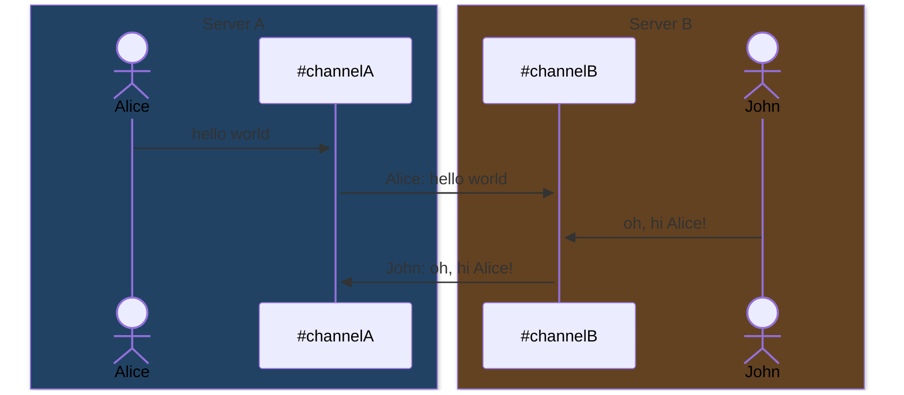

# discord_bridgebot

🔊 building bridges between communities 🔊

Discord bot to chat-link Channels (not servers) together. pass messages to other friendly, small communities.

```mermaid
sequenceDiagram
    box rgb(33,66,99) Server A
    actor Alice
    participant channelA as #35;channelA
    end
    box rgb(99,66,33) Server B
    participant channelB as #35;channelB
    actor John
    end


    Alice->>+channelA: hello world
    channelA->>+channelB: Alice: hello world
    John->>+channelB: oh, hi Alice!
    channelB->>+channelA: John: oh, hi Alice!
```
